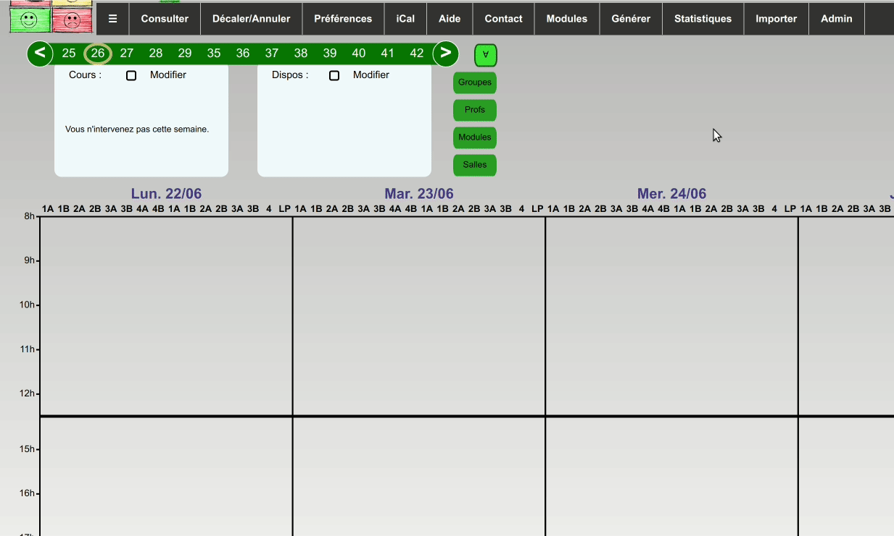

# Définir les contraintes d'emploi du temps

La définition des contraintes se fait à deux niveaux différents
1. Chaque utilisateur⋅ice doté⋅e d'un compte (enseignant⋅e, étudiant⋅e, ...) peut définir en toute autonomie 
ses indisponibilités et préférences de créneaux, ainsi que quelques autres préférences via l'interface.
2. La personne responsable de l'emploi du temps d'un département peut ajouter des contraintes/préférences
générales ou spécifiques en appliquant une des contraintes paramétrables présentes dans l'interface d'administration.

En fait il y'en aurait une troisième, qui consiste en la définition de nouvelles contraintes ad hoc, qui une fois
définies serait accessibles à tou⋅te⋅s via le 2., mais cela nécessite de mettre les mains dans le code... 
Si vous êtes intéressé⋅e par ça, regardez [cette vidéo](https://link.infini.fr/creer-ses-contraintes-dans-flopedt) 
(un peu longue, mais détaillée) et n'hésitez pas à 
[nous rejoindre sur framateam](https://framateam.org/signup_user_complete/?id=6bf6j8kzbpbfdye6uy3646p7ya) pour qu'on
puisse vous aider...

## Saisie des indisponibilités et préférences par les utilisateur⋅ice⋅s

Pour l'essentiel, c'est expliqué dans cette [vidéo tuto](https://www.youtube.com/watch?v=4uxITtWVkIs&feature=youtu.be).
On fera de la doc ici bientôt.

## Ajout des contraintes via l'interface **Contraintes**

La première étape consiste à lister (sur un feuille de papier ou dans un fichier texte) les contraintes/préférences,
que l'on souhaiterait voir appliquer.
Par exemple:
- pas plus de 4h de maths par jour pour les groupes première année
- essayer de faire venir les enseignants le moins de demie-journées possibles
- ...

Une fois que vous êtes au clair, il s'agit de se connecter avec un user ayant des droits suffisants et 
de cliquer sur l'onglet **Contraintes**.

:bulb: le paramètre `poids` définit s'il s'agit d'**une contrainte (si weight est laissé vide)** qui sera toujours respectée
ou d'une préférence (avec un degré d'importance de 1 à 8) que le solveur essaiera d'appliquer.

:bulb: Globalement, lorsqu'un paramètre autorise un choix multiple, **n'en prendre aucun signifie les considérer tous**.
Par exemple : Si vous choisissez les modules maths et français dans Limit modules time per period ça ne s'appliquera 
qu'à ces deux modules, mais si vous n'en cliquez aucun ça s'appliquera à tous!

:bulb: Les contraintes peuvent être saisies pour une semaine particulières ou pour toutes (laisser vide), 
pour une promotion particulière ou pour toutes (laisser vide), etc... 

:bulb: Attention, les contraintes ne sont valables que pour le département via lequel elles sont saisies!

### Contraintes de base
Ces contraintes sont enregistrées automatiquement à la première génération puis appliquées par défaut 
(il est possible néanmoins de les désactiver):
- Assign all courses : affecter un prof à chaque cours (ou seulement à ceux correspondants aux filtres)
- ConsiderDependencies : prend en compte les dépendance entre cours (Dependecy) enregistrées en base
- Consider pivots :prend en compte les pivots enregistrées en base
- Consider tutors unavailabilities : prend en compte les indispos (sens interdits) des profs
- Min groups half days : tente de libérer une/plusieurs demie-journées aux étudiant⋅e⋅s
- Min non prefered train progs slots : considère les indisponibilités et minimise les créneaux non préférés pour les groupes
- Min non prefered tutors slots	: minimise les créneaux non préférés pour les profs
- Minimize busy days: minimise les jours de présence des profs (en respectant leur journée idéale)
- No simultaneous group courses : évite qu'un groupe ait 2 cours en même temps
- Respecter les limites horaires : respecte la limite maximale définie par les profs
- Schedule all courses : planifie tous les cours (ou seulement à ceux correspondants aux filtres)

### Autres contraintes génériques

- Groups lunch breaks : force une pause d'une durée définie entre telle heure et telle heure pour les groupes choisis
- Tutors lunch breaks : idem, pour les enseignant⋅e⋅s / salarié⋅e⋅s
- Limit groups time per periods	: limite le nombre d'heures (d'un type donné) par jour/demie-journée pour
un ou plusieurs groupes.
- Limit modules time per periods : idem pour une ou plusieurs matières (éventuellement par promo) 
- Limit tutors time per periods	: idem, pour les enseignant⋅e⋅s / salarié⋅e⋅s
- Limit undesired slots per weeks : limite le nombre d'utilisation d'un certain créneau par semaine
- Limited room choices	: limite les salles possibles (pour un enseignant, un module, ...)
- Limited start time choices: limite les heures de début possible 
- Min modules half days : minimise les demie-journées pour les modules choisis
- Min tutors half days : minimise les demie-journées de présence/cours pour les profs choisis
- No group course on day: permet d'interdire tout cours sur une journée/demie-journée
- No tutor course on day: idem, pour les enseignant⋅e⋅s / salarié⋅e⋅s
- Simultaneous courses : impose qu'un ensemble de cours donnés soient simultanés
- Stabilize groups courses : évite de changer l'occupation du temps des groupes
- Stabilize tutors courses : évite de changer l'occupation du temps des profs
- Lower bound busy days : assure qu'un prof vienne au moins n jours
- Not alone for these course types : assure qu'un prof soit accompagné d'un autre prof quand il assure ces cours

### Contraintes spécifiques au mode Visio
- Bound Physical presence half days: met des bornes (min/max) sur le nombre de demies-journées de présene sur site pour les groupes d'étudiant⋅e⋅s
- Curfew : définit une heure à partir de laquelle les cours en présentiel sont proscrits
- Limit groups physical presence: permet de donner un ratio détudiant⋅e⋅s pouvant être simultanément sur site
- No Visio: force les cours concernés à être en présentiel
- Visio Only: force les cours concernés à être en visio

### Contraintes spécifiques au mode Cosmo
- Limit holes :
- Limit tutor time per weeks :

### Contraintes très spécifiques
- Break around course types :
- Modules by blocs :

### Spoiler alert
Vous ne trouverez probablement pas toutes les contraintes qui vous intéresseront dans cette liste. 
De nombreuses autres contraintes sont sur le point d'être ajoutées (on y travaille!). Si vous voulez nous y aider,
vous pouvez 
- simplement nous proposer une nouvelle contrainte qui vous serait utile en 
[nous envoyant un mail](mailto:contact@flopedt.org) 
- tenter d'en coder une vous-même en regardant [cette vidéo](https://link.infini.fr/creer-ses-contraintes-dans-flopedt) 
(un peu longue, mais détaillée) et en
[nous rejoignant sur framateam](https://framateam.org/signup_user_complete/?id=6bf6j8kzbpbfdye6uy3646p7ya) pour qu'on
puisse vous aider.

## Vérifier que les contraintes sont bien prises en compte
Outre dans l'interface dédiée, les contraintes apparaîtront également lorsque le⋅a gestionnaire voudra 
générer un emploi du temps, via l'onglet `Générer` : elles apparaîtront en une phrase compréhensible, lorsqu'une semaine unique est sélectionnée (que la contrainte
concerne uniquement cette semaine, ou qu'elles les concernent toutes.)

