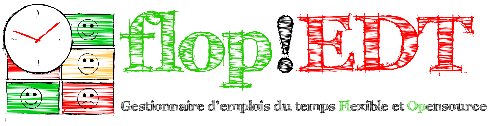

FlOpEDT/FlOpScheduler est un outil de gestion
d'emplois du temps comprenant :
- une application web permettant aux utilisateurs
  * d'exprimer leurs contraintes et préférences
  * de modifier l'emploi du temps
- un moteur de génération d'emplois du temps qui respectent les contraintes et
maximisent la satisfaction générale.

## Licence

[AGPL v3](https://www.gnu.org/licenses/agpl-3.0.html)

## Principales dépendances
- [Django](https://www.djangoproject.com/) pour le site
- [PostgreSQL](https://www.postgresql.org/) pour la base de données
- [PuLP](https://github.com/coin-or/pulp) pour la modélisation en ILP (Integer Linear Programming)
- Un solveur de ILP, e.g. [CBC](https://projects.coin-or.org/Cbc), [Gurobi](gurobi.com)
- [Redis](https://redis.io) pour le cache de Django (optionnel)

## Lancement de l'application dans Docker

Après l'installation de `docker` et `docker-compose`, lancez la
commande suivante :

`make start` (`make stop` pour arrêter l'application)

(En cas de

`ERROR: Couldn't connect to Docker daemon at http+docker://localhost - is it running?`

songez à une exécution en `sudo`.)

L'application sera accessible à l'adresse http://localhost:8000.

Vous pouvez importer les données d'exemple contenues dans le fichier [dump.json.bz2](./dump.json.bz2) (qui est une
base pour jouer avec l'interface) avec la commande :

`make init` 

Vous pourrez alors vous connecter avec l'utilisateur `MOI` et le mot
de passe `passe`. Cet utilisateur possède les droits associés aux
responsables des emplois du temps. Pour la vision d'une personne
enseignante classique, utiliser l'un des autres login (En fait, tous
les utilisateurs ont le même mot de passe `passe` !).

Deux exemples de configuration sont disponibles pour exécuter l'application avec Docker : `development` et `production`. La configuration `development` est utilisée par défaut par les cibles du fichier Makefile. Pour utiliser la configuration `production`, les deux étapes suivantes sont nécessaires :

- `CONFIG=production make install`
- `CONFIG=production make [build|init|start|stop]`

## Installation et lancement de l'application sans docker
Voir [ici](./FlOpEDT/misc/conf/README.md)

## Contributions
- [Discuter](https://framateam.org/flopedt/)
- [Soulever une issue](https://framagit.org/FlOpEDT/FlOpEDT/issues)

